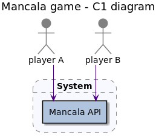
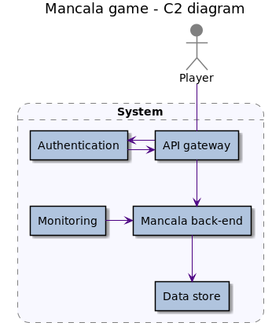
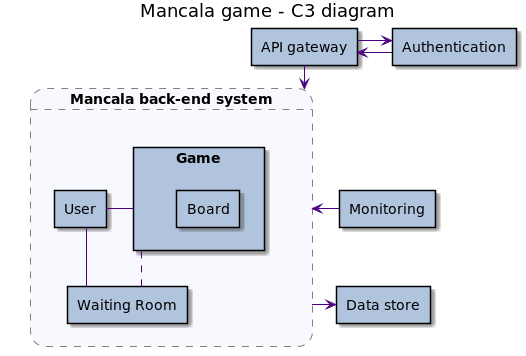
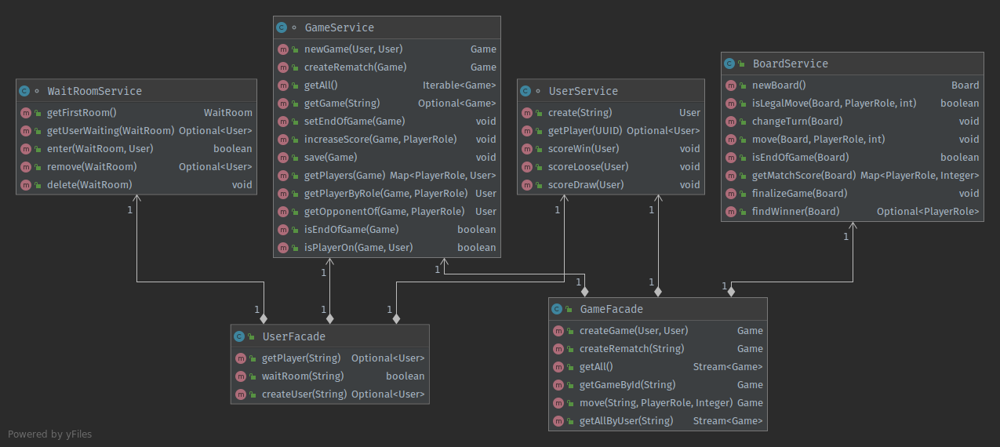
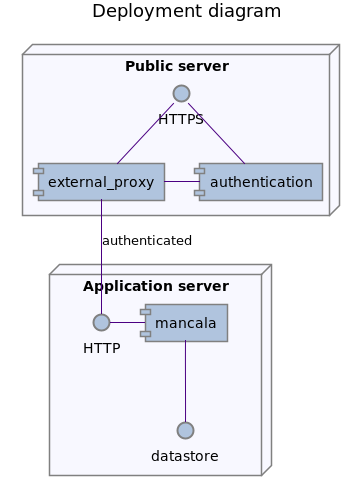

# Kalah/Mancala game project 

The project intends to produce a Kalah/Mancala game backend.


I had one implementation of the game I did earlier this year, which I adapted to have players on separate machines.

The original design split the game in three parts:
- Board: actual rules, mechanics and status
- Game: transactional game aspects, isolates players from the game board
- Player: here for the time restriction it is internally user and externally player. Which can be later split, but conceptually a player in this game maps to user.


## The plan







### Technical approach

It uses CQRS since the commands take only parameters and queries return aggregates. Though there is no decoupling of aggregates and stored entities, mostly to save time, and thanks the clean cut offered by a quick solution adopted to separate internal ids from public ids.

Since it is an exercise in Java, it was chosen to use latest Java stable, Spring Boot, JPA, H2 embedded database, Spring Boot embedded Tomcat web server. All running from docker images.  
Non-production code is mostly Groovy on Spock tests and Gradle builds.

The game "engine" was surfaced by exploring the game mechanics on a very compact implementation as seen in [MechanicsSpec ](src/test/groovy/org.shimomoto.mancala/MechanicsSpec.groovy) test. From there came the separation of board and game, where the board is only the data used by the game ; then later players from original turn role flags.

The functionality is accessible via public transactional facades which call fine-grained operations on non-public services derived from entities. The first only receive public/external ids or plain value parameters, the later take the entity as parameter when it is not fetching it via public ids. The advantages are isolation of concerns and very little coupling between entities.


Entities are stored with an id generated by code, not by the database, but the usage of entity version field allows seamless use.

### Tasks

* [x] setup project properly from spring initialzr and testing layer perspective
* [x] get minimal engine implementation with tests and tdd
    * [x] set model
    * [x] set operations
    * [x] set end game
* [x] add REST interface with controllers
* [x] refactor/cleanup from legacy implementation
* [x] players are remote, from different machines
    + [x] add players, with:
        - id
        - alias
        - game count
        - win count
    + ~~add authentication (reverse proxy?)~~
        - ~~only logged in access~~
    + ~~add authorization~~
        - ~~pass player id to endpoint~~
* [x] wait room for players, join 2 *different* players in a game
* ~~leaderboard to challenge other players (optional)~~
* [x] list ongoing and finished games for player
* [x] open ongoing game
* ~~only moves own player game and pit~~
* ~~only access own player's stats or games~~
* ~~check other player's stats (optional)~~
* simple error code + message ~~player gets message when it is not their turn yet (optional?)~~
* ~~integration tests (postman on docker?)~~
* [x] add data store
* [x] partially done kubernetes deploy
* [x] docker compose deploy
* ~~serve it (optional?)~~
* ~~final clean-up refactor for release v1~~



### The compromises

1. the waiting room is an entity on database, it is a poor choice but for time constraints I am not building a queue.  
The good solution would be to queue players that want to participate in a game, probably use a staggered `wins/games` ratio to tier players in different queues for better experience. Then an async process would consume pairs of players from the queue and create the games.

2. The game creation from waiting room should be a microservice in itself, and it should be able to search for latest game with the two players selected and then create a rematch game instead. To avoid adding this complexity here a new game is allowed when it would be a rematch.

3. In order to avoid DTOs, and thus a lot of boilerplate code, there is a serialization hack to get public ids from entities.  
DTOs should not be first concern when creating a POC, they are a natural change that comes after the drift between the API aggregates and the data store entities.

4. The error page redirects were done for just 404 and 500; they hide the spring boot app stack trace.  
  It could be done to all other errors, but it is just a repetitive exercise.
  
5. It is currently cumbersome to find a game once it is created, ideally communication should be async for that. Right now it is done by querying users games.

6. I had delays for personal reasons and lost 2 days worth of work here, which caused me to catch up on job work. Therefore, the security features, authentication and authorization went out of scope, I intend to complete that part as an exercise, but it will not be in time for evaluation.

### Reasoning

Instead of creating a game missing the second player, I added the waiting room concept, which can later be used as means for a leaderboard matching or to have games among a small selected group.

The intention behind rematch is for a player not only have a general score over all games regardless the opponents, but also have a specific score between a pair of players.

### Security
 
Authentication is to be enforced at the reverse proxy, keeping the app free of that complexity.
The plan is to use Vouch at the reverse proxy and validate users against google or twitter.

Authorization will be done with an user identifier added to the headers at the reverse proxy, that allows the app to uniquely identify users, then controller filters will allow/deny/redirect users on their requests.

Spring security was added so all incoming requests would have an API token as extra security layer. In this case the token would be added by the reverse proxy itself.

## How to build

> requires JDK 14, you can get it with https://sdkman.io/install

```bash
gradle 
```
## How to run

### _TL,DR;_ From sources

```bash
gradle && gradle bootRun
```
> _NOTE:_ Other options bellow in deployments
>
### How to test

A rudimentary test of a single game.

```bash
./test.sh
```

Swagger:  
http://localhost:8080/swagger-ui/index.html?configUrl=/v3/api-docs/swagger-config

Database:  
http://localhost:8080/h2-console

 ## Conventions

The best way to understand how to use the classes in the project is through the extensive unit tests, that is also the rationality of not providing Low Javadocs usage, in order to learn how to use a class check the unit tests. Javadocs added when information is critical and cannot be conveyed through testing.  
Any exposed REST API is documented though, as would any java library public API. 

Testing with Spock first for readability, also to save time and portability with best in class reports.

### Test documentation

Run tests (`gradle check`) then check output at [./build/reports/spock-reports/test](./build/reports/spock-reports/test/index.html) and [./build/reports/spock-reports/integrationTest](./build/reports/spock-reports/integrationTest/index.html)

### Coverage report

Run tests (`gradle check`) then check JaCoCo output at [./build/reports/jacoco/test/html](./build/reports/jacoco/test/html/index.html)
 
### Tests

* Aim at high unit test coverage for fast builds, some Integration test coverage for smoke tests.
* Single letter variables denote a mock or that the variable is not relevant but required to process

## Docker-compose deployment

> _NOTE:_ requires docker, docker-compose

In order to hide all technical endpoints (actuator, swagger) we need a reverse proxy. Another aspect added is monitoring.

1. Build an image (preferably checkout a tag):
   ```
   gradle && gradle jibDockerBuild
   ``` 
2. create the containers from project root:
   ```
   docker-compose down --remove-orphans \
   docker-compose up -d --force-recreate --remove-orphans
   ```
4. On separate consoles you may want to inspect each part:
   ```
   docker-compose logs -t app
   docker-compose logs -t proxy
   docker-compose logs -t prometheus
   ```
5. Access the app at: https://localhost/mancala/api/*

6. Stop and remove it:
   ```
   docker-compose down --volumes --remove-orphans
   ```

## Manual Kubernetes deployment with minikube

Just a demonstration, for full deployment use the next section on Kubernetes config deploy.

> NOTE: using minikube and jib, commands may differ on a non-linux env

1. Start minikube:
    ```
    minikube start
    ```
   
2. Enable minikube to use docker daemon's images:
    ```
    eval $(minikube docker-env)
    ```
   
3. Build an image (preferably checkout a tag):
    ```
    gradle && gradle jibDockerBuild
    ``` 

4. Check if you see new images one with a version and the other as latest :
    ```
    docker images | grep 'org.shimomoto'
    ``` 

5. Create a pod:
    1. _OPTIONAL:_ If you are doing this a second time you may need to clean up first: 
        ```
        kubectl delete pod/mancala
        ```
   2. Create the pod:
       ```
       kubectl run mancala \
         --image=org.shimomoto/mancala:latest \
         --port=8080 \
         --image-pull-policy Never
       ```
   
6. Verify if all is correct:

    1. deployments, probably empty:
        ```
        kubectl get deployments
        ```
   
    2. pod should be running:
        ```
        kubectl get pods
        ```
       
7. Expose the port to the app:
   ```
   kubectl expose pod mancala --type=NodePort
   ```
   1. check which port was open on local
       ```
       kubectl get services
       ```

8. Access the service:
   ```
   minikube service mancala
   ```
   
    1. On the browser, the user and password are from `resources/application.yml`, used to be: 
        + user: `marco`
        + pwd: `polo`
        
    2. You should see a banner page.
    
9. Once no longer needed:
    ```
    kubectl delete service/mancala pod/mancala
    docker rmi -f org.shimomoto/mancala:latest org.shimomoto/mancala:$(git describe --dirty=.dirty)
    ```

---

Diagrams taken from Idea or written with PlantUML
